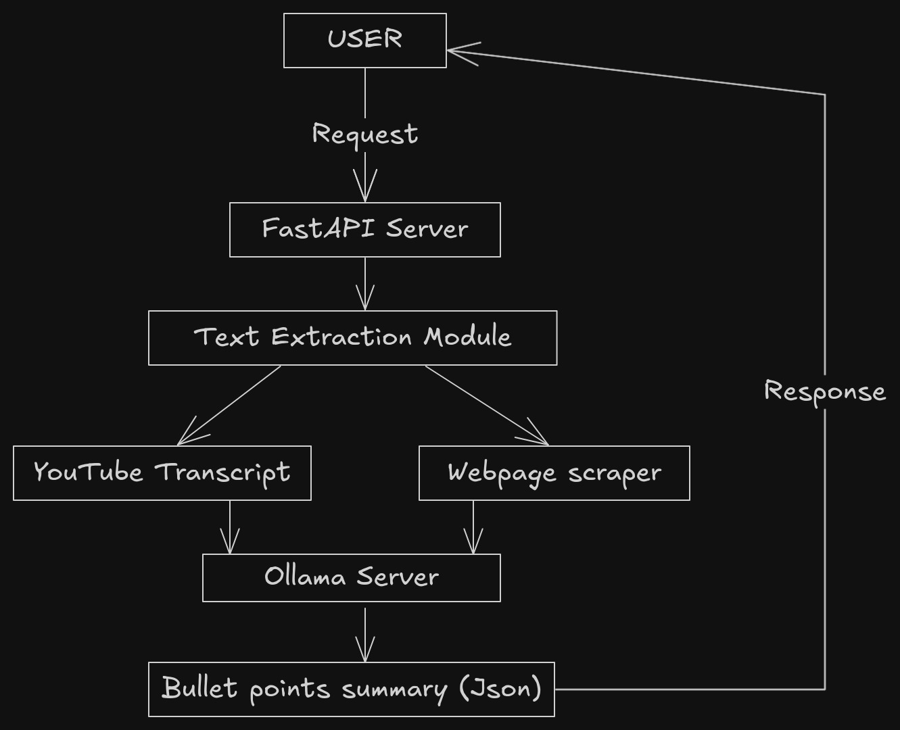

# Summora: Local AI-Powered Webpage & YouTube Video Summarizer

[](https://python.org)
[](LICENSE)
[](https://ollama.ai)

A privacy-first summarization tool that generates dynamic bullet-point summaries from webpages and YouTube videos using local AI processing. No cloud dependencies, no data leaks!

## Features ✨

- **Dynamic Summarization Levels** (1-5) - From concise overviews to detailed breakdowns
- **Dual Content Support** - Webpages & YouTube videos
- **Local AI Processing** - Powered by Ollama (Gemma:3B)
- **Self-Hosted** - Full control over your data

## Installation 🛠️

### Prerequisites

- Python 3.9+
- [Ollama](https://ollama.ai) installed
- 8GB+ RAM recommended

```bash
# 1. Start Ollama service
OLLAMA_DEBUG=4 ollama serve

# 2. Install AI model (choose one)
ollama pull gemma3  # Lightweight option
# ollama pull mistral  # More powerful

# 3. Clone repository
git clone https://github.com/yourusername/summora.git
cd summora

# 4. Install dependencies
pip install -r requirements.txt
```

## Usage 🚀

### Start API Server

```bash
uvicorn main:app --reload --host 0.0.0.0 --port 8000
```

### Example Requests

**cURL:**

```bash
curl -X POST "http://localhost:8000/summarize" \
-H "Content-Type: application/json" \
-d '{
  "url": "https://youtu.be/dQw4w9WgXcQ",
  "level": 3
}'
```

**Python Client:**

```python
import requests

response = requests.post(
    "http://localhost:8000/summarize",
    json={
        "url": "https://example.com/article",
        "level": 4  # 1=concise, 5=detailed
    }
)
print(response.json()["summary"])
```

### Browser Extension Setup

1. Enable developer mode in Chrome/Firefox
2. Load unpacked extension from `/extension` directory
3. Click icon on any webpage/YouTube video
4. Select detail level (1-5)


## API Documentation 📚

### POST /summarize

**Request Body:**

```json
{
  "url": "string (required)",
  "level": "integer (1-5)"
}
```

**Success Response:**

```json
{
  "summary": "• Point 1\n• Point 2\n• Point 3"
}
```

**Error Responses:**

| Code | Description               |
| ---- | ------------------------- |
| 400  | Invalid URL format        |
| 422  | Content extraction failed |
| 429  | Rate limit exceeded       |
| 500  | Internal server error     |

## Development 👨💻

### Tech Stack & Architecture

| Component          | Technology                        |
| ------------------ | --------------------------------- |
| Backend            | Python + FastAPI                  |
| AI Engine          | Ollama + Gemma-3B/Mistral         |
| Web Scraping       | BeautifulSoup4 + readability-lxml |
| YouTube Processing | youtube-transcript-api            |
| Frontend           | React + Tailwind CSS              |
| Browser Extension  | WebExtensions API                 |



### File Structure

```text
summora/
├── main.py            # FastAPI server
├── web_ui/            # React frontend
├── requirements.txt
└── docs/
    └── architecture.png
```

### Contributing

1. Fork the repository
2. Create feature branch (`git checkout -b feature/amazing-feature`)
3. Commit changes (`git commit -m 'Add amazing feature'`)
4. Push to branch (`git push origin feature/amazing-feature`)
5. Open Pull Request

## License 📄

MIT License - See [LICENSE](LICENSE) for details

## Acknowledgments 🙏

- [Ollama](https://ollama.ai) team for revolutionary local AI tools
- [FastAPI](https://fastapi.tiangolo.com) for modern Python APIs
- [Readability](https://github.com/mozilla/readability) team for content extraction

---

**Privacy First:** All processing happens locally - no data is collected, stored, or transmitted to external services. Your browsing remains private!

```text
For the architecture diagram, use this [Excalidraw template](https://excalidraw.com/#json=9QY7J7q9JxZ9z2QY7Y7J7,2QY7J7q9JxZ9z2QY7Y7J7) and save as `docs/architecture.png`. The browser extension demo GIF can be created using [ScreenToGif](https://www.screentogif.com/).
```
